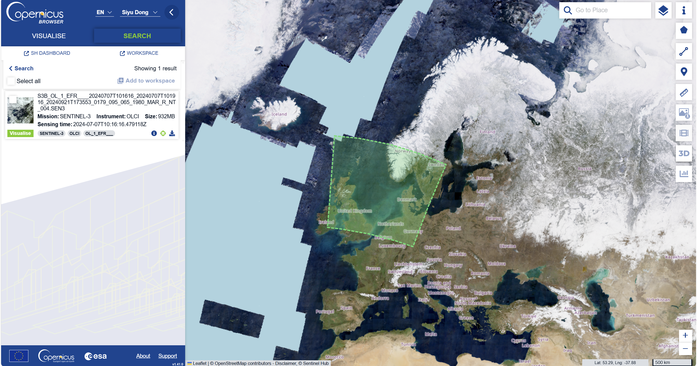
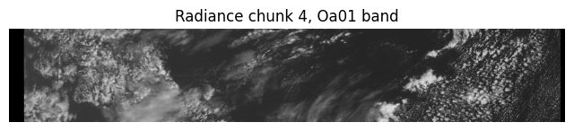
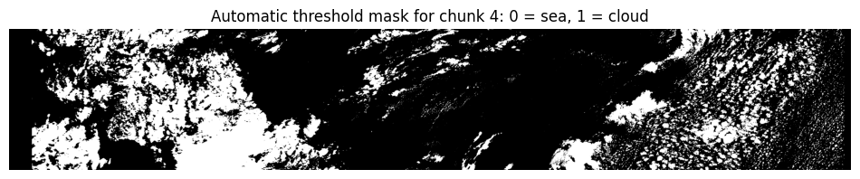
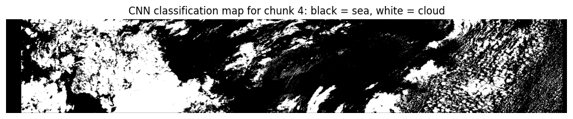
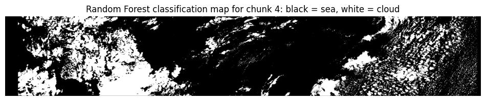
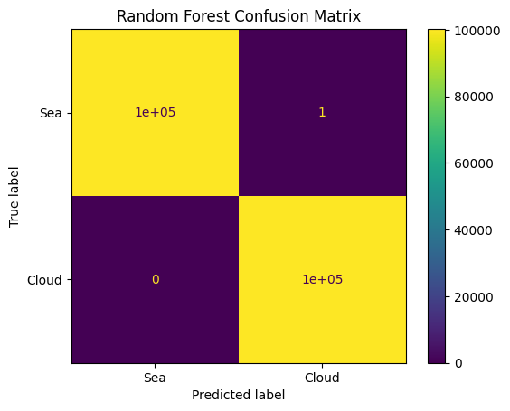
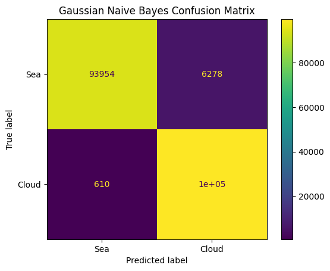
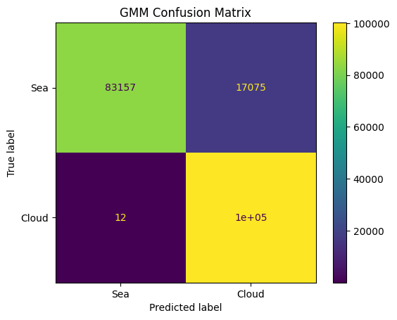
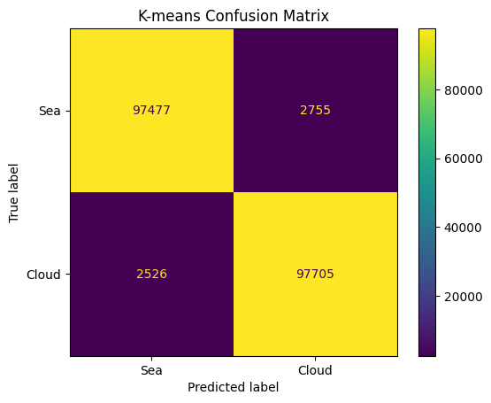

# Cloud Coverage Classification over Ocean Surfaces Using Sentinel-3 OLCI Imagery

## Project overview

This project addresses a cloud coverage classification task using satellite imagery. The aim is to distinguish between cloud-covered pixels and clear sea-surface pixels using Sentinel-3 OLCI Level-1 EFR radiance data.

Cloud detection is an important preprocessing step in Earth observation because cloud-covered pixels can strongly affect the interpretation of ocean colour, surface reflectance and other satellite-derived environmental variables. In this project, Sentinel-3 OLCI spectral radiance bands are used as input features for different supervised and unsupervised classification models.

The project follows the **Classification of Cloud Coverage** option from the GEOL0069 AI for Earth Observation coding assignment.

---

## Data source

The data used in this project is a Sentinel-3B OLCI Level-1 EFR product downloaded from the [Copernicus Data Space Ecosystem](https://dataspace.copernicus.eu/) using the [Copernicus Browser](https://browser.dataspace.copernicus.eu/).

The Copernicus Data Space Ecosystem provides access to Sentinel satellite data, while the Copernicus Browser was used to search for and download the selected Sentinel-3 OLCI product.

The selected product is:

```text
S3B_OL_1_EFR____20240707T101616_20240707T101916_20240921T173553_0179_095_065_1980_MAR_R_NT_004.SEN3
```

Product information:

```text
Mission: Sentinel-3B
Instrument: OLCI
Product type: Level-1 EFR
Sensing time: 2024-07-07T10:16:16
```

The screenshot below shows the selected Sentinel-3B OLCI product in Copernicus Browser, including its spatial footprint around the United Kingdom and nearby ocean surfaces.



This scene was selected because it contains both clear sea-surface pixels and cloud-covered areas, making it suitable for a binary cloud and sea classification task.

The notebook uses the 21 OLCI radiance files:

```text
Oa01_radiance.nc
Oa02_radiance.nc
...
Oa21_radiance.nc
```

These 21 NetCDF radiance bands are converted into a single NumPy array:

```text
radiance.npy
```

The full image is then split into five smaller chunks to reduce memory use. Chunk 4 was selected for model training and prediction because it contains a useful mixture of clear sea-surface pixels and cloud-covered pixels.

Large raw data files are not included in this GitHub repository because the Sentinel-3 product and the generated NumPy arrays are too large. The notebook contains the full code used to convert the original NetCDF radiance files into NumPy arrays and reproduce the processing workflow.

---

## Repository structure

```text
Cloud-And-Sea-Classification/
├── README.md
├── Cloud_And_Sea_Classification.ipynb
└── figures/
    ├── olci_chunk4_oa05_band.png
    ├── automatic_mask_chunk4.png
    ├── cnn_classification_map_chunk4.png
    ├── rf_classification_map_chunk4.png
    ├── rf_confusion_matrix.png
    ├── gnb_confusion_matrix.png
    ├── gmm_confusion_matrix.png
    └── kmeans_confusion_matrix.png
```

The main Python code is stored in:

```text
Cloud_And_Sea_Classification.ipynb
```

The output figures used in the results section are stored in:

```text
figures/
```

---

## Methodology

### 1. Data preprocessing

The 21 Sentinel-3 OLCI radiance bands were read from NetCDF format and stacked into a single three-dimensional NumPy array. Each pixel is represented by 21 spectral-band values.

The converted array was then split into five smaller chunks along the row dimension. This made the later training and prediction steps easier to run in Google Colab.

### 2. Automatic mask generation

An automatic binary mask was created from a visible OLCI band using a brightness threshold. Cloud-covered pixels are generally brighter than clear sea-surface pixels in visible wavelengths.

The mask uses two classes:

```text
0 = clear sea surface
1 = cloud-covered pixel
```

This mask was used as the label source for the supervised classification models.

### 3. Training and testing samples

For each labelled pixel, a local spectral-spatial patch was extracted:

```text
3 × 3 × 21
```

This means that each sample contains a 3 by 3 pixel neighbourhood and all 21 OLCI spectral bands. The dataset was balanced so that sea and cloud classes had similar numbers of training and testing samples.

### 4. Classification models

Five models were tested:

| Model | Learning type | Role |
|---|---|---|
| CNN | Supervised deep learning | Main deep-learning classifier |
| Random Forest | Supervised machine learning | Main classical machine-learning classifier |
| Gaussian Naive Bayes | Supervised baseline | Simple statistical baseline |
| GMM | Unsupervised baseline | Clustering comparison |
| K-means | Unsupervised baseline | Clustering comparison |

The CNN and Random Forest models were also applied back to the full selected OLCI chunk to generate spatial classification maps.

---

## Remote sensing and classification workflow

The workflow used in this project is:

```text
Sentinel-3 OLCI Level-1 EFR product
        ↓
Read 21 OLCI radiance bands
        ↓
Convert NetCDF files to NumPy array
        ↓
Split image into smaller chunks
        ↓
Select chunk 4
        ↓
Create automatic threshold mask
        ↓
Extract 3 × 3 × 21 patches
        ↓
Train and test classification models
        ↓
Generate cloud/sea classification maps
```

---

## Input OLCI image

The selected OLCI chunk contains both dark sea-surface pixels and bright cloud-covered pixels.



---

## Automatic threshold mask

The automatic binary mask was generated using a visible OLCI band. Black pixels represent sea surface and white pixels represent cloud-covered areas.



---

## Classification results

### CNN classification map

The CNN model was trained using balanced 3 × 3 × 21 spectral-spatial patches and then applied back to the full selected OLCI chunk.



### Random Forest classification map

The Random Forest model was trained using the same balanced training and testing datasets. The 3 × 3 × 21 patches were flattened into one-dimensional feature vectors before training.



---

## Model comparison

The table below summarises the model performance on the balanced testing dataset.

| Model | Learning type | Accuracy | Main output | Interpretation |
|---|---|---:|---|---|
| CNN | Supervised deep learning | 0.9982 | CNN classification map | Very high performance; used for spatial cloud classification |
| Random Forest | Supervised machine learning | 1.0000 | RF confusion matrix and classification map | Highest quantitative performance; used for spatial cloud classification |
| Gaussian Naive Bayes | Supervised baseline | 0.9656 | Confusion matrix | Good simple supervised baseline |
| GMM | Unsupervised baseline | 0.9148 | Confusion matrix | Weakest baseline, but useful as an unsupervised comparison |
| K-means | Unsupervised baseline | 0.9737 | Confusion matrix | Best unsupervised baseline in this workflow |

The supervised models performed best in this classification task. The Random Forest model achieved the highest testing accuracy, followed closely by the CNN model. This suggests that the labelled threshold mask provided a strong training signal for separating clear sea-surface pixels from cloud-covered pixels using the 21 Sentinel-3 OLCI spectral bands.

The Gaussian Naive Bayes model also performed well, although its accuracy was lower than the CNN and Random Forest models. Among the unsupervised methods, K-means performed better than GMM. This indicates that the broad spectral contrast between dark sea surface and bright cloud pixels can be separated to some extent without labels, although the supervised methods were more reliable.

---

## Confusion matrices

### Random Forest confusion matrix



### Gaussian Naive Bayes confusion matrix



### GMM confusion matrix



### K-means confusion matrix



---

## Environmental cost assessment

This project used open-access Sentinel-3 OLCI data and was run in Google Colab. The main environmental costs come from cloud computing, data transfer and temporary cloud storage. The original Sentinel-3 product is large, and converting the 21 NetCDF radiance files into NumPy arrays requires memory and processing time.

The CNN model required more computational resources than the classical machine-learning models because it involved iterative neural network training. The Random Forest model also required processing many training samples, but it was faster to interpret and apply. Gaussian Naive Bayes, GMM and K-means were included as simpler baseline models with lower computational complexity.

Several choices were made to reduce computational cost:

- Only one selected OLCI chunk was used for model training and prediction.
- The large image was split into smaller chunks to reduce memory use.
- The CNN was trained for a small number of epochs.
- Lightweight baseline models were included for comparison.
- Large intermediate NumPy arrays were not uploaded to GitHub.

Overall, the project used a relatively small subset of the full Sentinel-3 scene, which helped reduce unnecessary computation while still allowing cloud and sea classification to be tested.

---

## How to run the notebook

1. Download a Sentinel-3 OLCI Level-1 EFR product from Copernicus Data Space.
2. Upload the extracted `.SEN3` folder to Google Drive.
3. Open the notebook in Google Colab.
4. Update the data path in the notebook:

```python
nc_dir = '/content/drive/MyDrive/AI/Week10/S3B_OLCI_CloudSea_20240707.SEN3/'
```

5. Run the notebook cells in order.

The notebook will:

```text
1. Mount Google Drive
2. Convert OLCI NetCDF radiance bands into NumPy arrays
3. Split the data into smaller chunks
4. Create an automatic cloud/sea mask
5. Generate balanced training and testing datasets
6. Train CNN, Random Forest, Gaussian Naive Bayes, GMM and K-means models
7. Save classification maps and confusion matrices
```

---

## Main outputs

The main outputs from this project are:

```text
cnn_classification_map_chunk_4.png
rf_classification_map_chunk_4.png
rf_confusion_matrix.png
gnb_confusion_matrix.png
gmm_confusion_matrix.png
kmeans_confusion_matrix.png
```

These are included in the `figures/` folder.

---

## Video explanation

The accompanying video explains:

1. The cloud coverage classification problem.
2. The Sentinel-3 OLCI data source.
3. How the 21 radiance bands were converted and split into chunks.
4. How the automatic threshold mask was generated.
5. How the CNN and Random Forest models were trained and applied.
6. How the supervised and unsupervised model results compare.
7. The environmental cost of running the project.

Video link:

```text
Add video link here
```

---

## Conclusion

This project classified cloud-covered and clear sea-surface pixels using Sentinel-3 OLCI Level-1 EFR radiance data. The 21 OLCI radiance bands were converted from NetCDF files into a NumPy array and split into smaller chunks to reduce memory use. Chunk 4 was selected because it contained both clear sea-surface and cloud-covered areas.

A threshold-based binary mask was generated from a visible OLCI band and used to create labelled training and testing samples. The labelled pixels were converted into balanced 3 × 3 × 21 spectral-spatial patches. The final training and testing datasets were balanced between the sea and cloud classes, which reduced class imbalance during model training.

Several classification models were tested. The CNN and Random Forest models were used as the main supervised classifiers, while Gaussian Naive Bayes was included as a simple supervised baseline. GMM and K-means were tested as unsupervised baseline methods. The supervised models achieved the highest test accuracy, with Random Forest and CNN both performing very strongly. Among the unsupervised methods, K-means performed better than GMM.

The CNN and Random Forest models were also applied back to the selected OLCI chunk to produce spatial cloud classification maps. These outputs show that Sentinel-3 OLCI spectral information can be used to distinguish cloud-covered pixels from clear sea surface. However, the very high accuracy values should be interpreted carefully because the training and testing samples were generated from the same selected scene using an automatic threshold-based mask. Further testing on independent Sentinel-3 OLCI scenes from different dates and locations would be needed to assess how well the workflow generalises.
